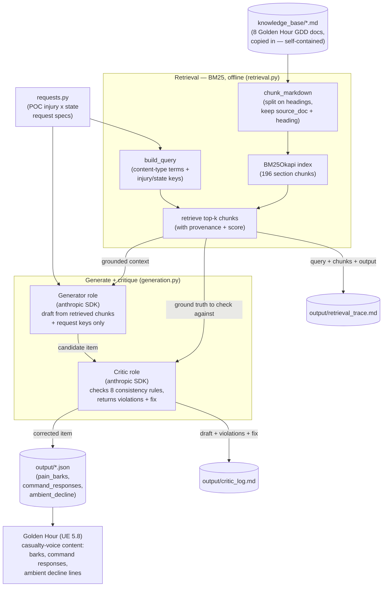

# Golden Hour — Dynamic Content Pipeline (RAG)

This repo is my submission for **Assignment #4 (Dynamic Content Pipeline)** in
ELVTR's *Multi-Agent AI for Game Development* course. It generates
game-specific content for my capstone game, **Golden Hour**, using the game's
own design docs as source material via **retrieval-augmented generation
(RAG)** — retrieve relevant GDD chunks, generate content that sounds like the
game, and run a **critic agent** that catches and corrects lore, tone, and
clinical-consistency breaks.

**Golden Hour** is a single-player VR serious game (Unreal Engine 5.8, PC
VR/OpenXR, Quest 3 via wireless streaming) that trains EMS/paramedic trainees
to triage, treat, and extract casualties from a mass-casualty incident (MCI).
Every casualty is backed by the open-source **Pulse Physiology Engine**, so a
casualty's face, breathing, and behavior are a *live clinical readout*, not
scripted animation — a Yellow casualty can genuinely decay to Red while the
trainee works elsewhere. Trainees run **SALT** triage and **MARCH**-ordered
interventions in a re-escalating warm zone.

> **Assignment #3 vs #4.** My A#3 repo (`golden-hour-agent-crew`) fed the crew
> a hand-distilled `design_facts.md` — a plain file read, *not* RAG. A#4 does
> real retrieval: it indexes the eight raw GDD documents at runtime with BM25
> and grounds every generation in the chunks it retrieves, so the content
> tracks the GDDs' actual vocabulary and rules instead of a summary I wrote by
> hand.

## The content gap this fills

Golden Hour's design is deep on *systems* (physiology LOD, SALT derivation,
the seven-stage facial-affect pipeline) but **thin on authored casualty
voice**. Three kinds of line are specified as requirements but not written:

1. **Pain / plea barks** — the short vocalizations a wounded casualty emits,
   keyed by injury × severity × consciousness × respiratory status × affect.
2. **Command-response lines** — what a casualty says or does when the trainee
   issues a voice command ("if you can hear me, wave"; "move to the flag if
   you can walk") — the SALT global-sort behavior (Pillar 5, *the scene
   listens*).
3. **Ambient decline vocalizations** — non-command idle lines that track
   physiology decay over time (Pillar 2, *the face/voice is a vital sign*).

All three are **casualty voice**, and all three must obey hard clinical rules
the GDDs state (a casualty in respiratory distress cannot deliver calm
sentences; an unconscious casualty produces no words; compliance gates on
hearing, not leg function). That is exactly the kind of content where a critic
agent earns its place.

## What this pipeline produces

One live run writes to `output/`:

| File | Contents |
|---|---|
| `pain_barks.json` | 5 pain/plea barks across the POC injury space |
| `command_responses.json` | 5 command-response lines across the SALT compliance gate |
| `ambient_decline.json` | 5 ambient decline lines across early/mid/late decay |
| `retrieval_trace.md` | Per item: the exact query, the top retrieved chunk(s) with source doc + heading, and the resulting output — side by side |
| `critic_log.md` | Per item: the pre-critic draft, the violations the critic flagged, and the corrected post-critic version |

Each generated item is **pydantic-validated structured JSON**: the line text
(or a described non-verbal vocalization), the trigger/gating condition, the
injury/consciousness/hearing/mobility/affect keys, and a `physiology_trace`
field that names the physiology variable the line derives from.

## The RAG flow

The same diagram source is committed standalone as
[`architecture.mmd`](architecture.mmd).



1. **Retrieve.** Every one of the 8 GDD docs in `knowledge_base/` is chunked by
   markdown section (196 chunks), each keeping its `(source_doc, heading)`
   provenance, and indexed with BM25 (`rank-bm25`, pure Python — no vector DB,
   no embedding service, no network). For each request the pipeline builds a
   targeted query from the content-type terms + the injury/state keys, and
   retrieves the top-k chunks (default 4).
2. **Generate.** The *generator* role (Anthropic SDK, default
   `claude-sonnet-4-5`) authors one candidate item from **only** the retrieved
   chunks + the request keys.
3. **Critique → revise.** The *critic* role reviews the draft against the same
   retrieved context and an explicit **8-rule** consistency list, returns the
   violations, and emits a corrected item. The loop runs one
   generate → critique → revise cycle per item and logs the before/after.

## How to run

Prerequisites: [uv](https://docs.astral.sh/uv/) and (for the live run only) an
Anthropic API key. The repo commits `.python-version` (3.13) and `uv.lock`, so
`uv sync` deterministically selects Python 3.13 (downloading it if needed — the
system default here is 3.14, which some wheels reject) and installs the exact
locked dependency set.

Windows PowerShell:

```powershell
git clone <this-repo-url>
cd golden-hour-content-pipeline
uv sync

# Offline — no API key needed:
uv run python -m pipeline.selftest      # retrieval self-test (3 known queries)
uv run python -m pipeline --no-llm      # dry run: queries + chunks + prompts

# Live generation — needs a key:
$env:ANTHROPIC_API_KEY = "sk-ant-your-key"
uv run python -m pipeline               # generate + critique, write output/
```

Notes:

- The API key is read from the environment only. It is never committed — `.env`
  is gitignored, and `.env.example` documents the two variables.
- The model defaults to `claude-sonnet-4-5`; override with
  `$env:MODEL = "<model-id>"`.
- `--top-k N` overrides how many chunks are retrieved per request.
- **Offline vs live.** The retrieval self-test and `--no-llm` dry run run fully
  offline with no key — they prove the RAG front half (chunking, indexing,
  query building, prompt assembly) end to end. Only `uv run python -m pipeline`
  calls Anthropic.

## Repo layout

| Path | Purpose |
|---|---|
| `knowledge_base/` | The 8 Golden Hour GDD docs, copied in so the repo is self-contained and runnable after a clean clone |
| `pipeline/retrieval.py` | BM25 section-chunking + indexing + query building + provenance — the RAG core |
| `pipeline/requests.py` | The POC injury × state request specs for all three content types |
| `pipeline/schema.py` | Pydantic schemas for the three content types + the critic verdict |
| `pipeline/prompts.py` | The 8-rule consistency list + generator/critic prompt builders |
| `pipeline/generation.py` | Anthropic SDK generator + critic calls, robust JSON extraction, schema validation |
| `pipeline/pipeline.py` | Orchestration: dry run, live run, and the trace/output writers |
| `pipeline/selftest.py` | Offline retrieval self-test (3 known queries → expected source doc) |
| `pipeline/__main__.py` | CLI (`--no-llm`, `--selftest`, `--top-k`) + top-level error guard |

## Rubric map

| Criterion | Where it is satisfied |
|---|---|
| **Game-Anchored Source** | `knowledge_base/` holds the game's own 8 GDDs (not a hand-written summary); every generation is grounded in chunks retrieved from them, with `(source_doc, heading)` provenance shown in `output/retrieval_trace.md` |
| **Content Fit** | Three casualty-voice content types the game specifies but hasn't authored (`pain_barks`, `command_responses`, `ambient_decline`); each item is game-ready structured JSON with the injury/state keys the runtime keys off, plus a `physiology_trace` field tying the line to a Pulse variable |
| **RAG Implementation** | `pipeline/retrieval.py` — real runtime retrieval: BM25 over 196 section chunks, targeted per-request queries, top-k grounded context passed into generation. `pipeline/selftest.py` proves retrieval hits the right doc; `--no-llm` prints the full retrieve→prompt path |
| **Consistency Checking** | `pipeline/prompts.py` 8-rule list + the critic role in `pipeline/generation.py`; the generate→critique→revise loop logs each draft, the violations flagged, and the correction in `output/critic_log.md`. Several request states (unconscious, respiratory distress, conscious-but-deaf) sit on a hard rule so the critic reliably has a real break to catch |
| **Voice Judgment** | See the section below — to be filled after a real run |

## Voice Judgment (fill after a live run)

> **Placeholder — complete this after `uv run python -m pipeline` with a live
> key.** Cite specific generated artifacts:
>
> - **Best bark**: quote one line from `output/pain_barks.json` and say why it
>   reads as a real casualty in that physiological state (name its
>   `physiology_trace`), not melodrama.
> - **Pillar-5 gate working**: cite the `output/command_responses.json` item
>   for the *conscious-but-deaf, ambulatory* casualty — the legs work but the
>   casualty does not comply, because compliance gates on hearing. Confirm the
>   `compliance` field is `no-response`.
> - **A real critic catch**: quote one before/after pair from
>   `output/critic_log.md` where the critic caught a rule break (e.g. an
>   unconscious casualty drafted with quoted words, corrected to a described
>   moan) and explain why the correction is right.
> - **Weakest line + why**: name one generated line that still feels off and
>   what rule or tuning would fix it.

## What is verified vs. not

- **Verified offline (no API key):** `uv sync` on pinned Python 3.13; the
  retrieval self-test (3/3 queries hit their expected doc); the `--no-llm` dry
  run for all three content types; every module imports cleanly; the JSON
  extractor and the fail-fast no-key guard.
- **Not verified here:** the live Anthropic generation (generator + critic
  calls) — there is no API key in the build environment. That code is written,
  type-checked, and import-clean, but running it requires a key. Run
  `uv run python -m pipeline` with a valid `ANTHROPIC_API_KEY` to produce the
  `output/*.json` content files and the two trace files, then complete the
  Voice Judgment section above.

---

Chad Josewski — ELVTR Multi-Agent AI for Game Development, Assignment #4
